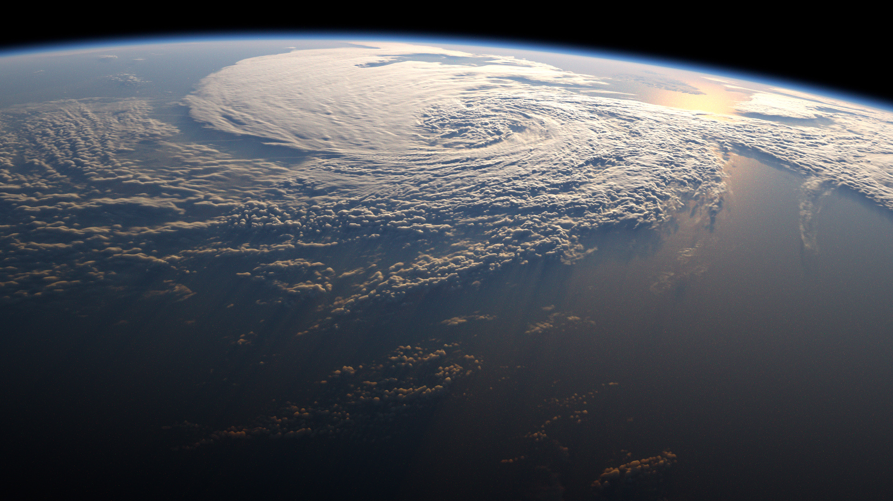
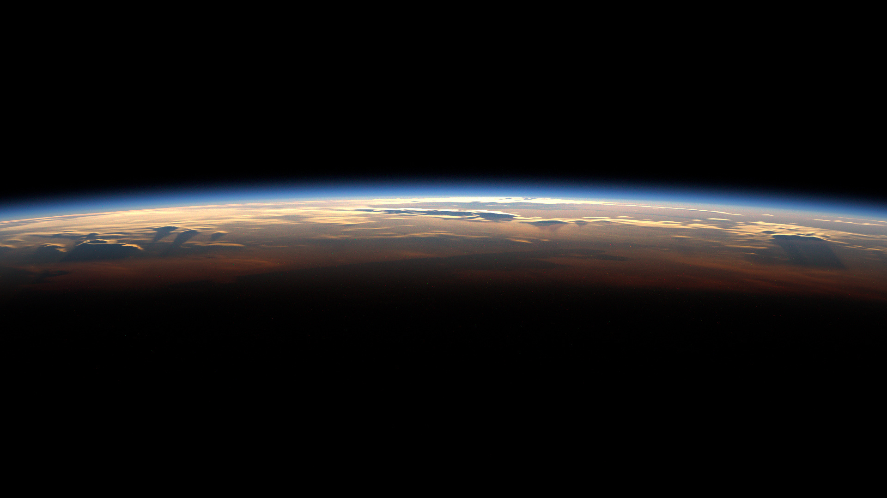
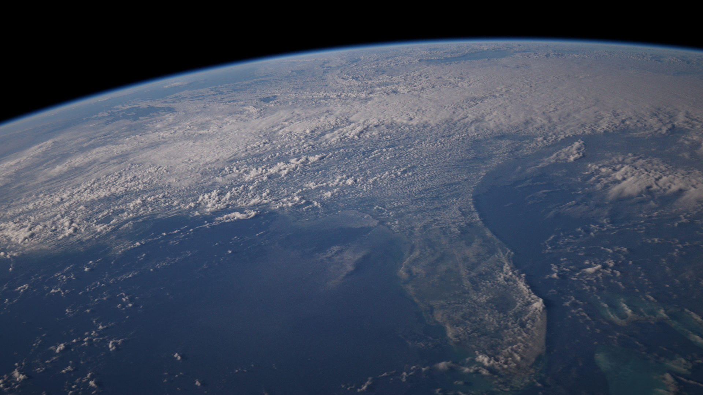

# <a name="title">Earth Viewer</a>
Demo shots             |  1080p
:-------------------------:|:-------------------------:
 | 
 | 


## Overview
A renderer that generates highly realistic images of the Earth from outer space. 

Rendering is done with Path Tracing in participating media. 
+ Uses measured data for density and light response (extinction coeficients and scattering functions) of atmospheric gases.
  + Rayleigh scatterers: Nitrogen (N2), Oxygen (O2),  Carbon Dioxide (CO2)
  + Mie scatterers: Water vapour
  + Other absorbers: Ozone (O3)
+ Uses textures from NASA for ground albedo, water bodies, topology, clouds.
+ Uses spectral rendering to get an accurate representation of colours. 
+ Uses importance sampling in the form of direct light (sun) sampling and phase function pdf.

**Taichi Lang documentation:** https://docs.taichi-lang.org/

## Step-by-step Installation

1. Install dependencies of the renderer. (Assuming you have Python)
```bash
pip install -r requirements.txt
```

2. Then download textures from [here (google drive)](https://drive.google.com/drive/folders/1RPspOXGj9JEV4nX78C5mGNWEgzic9dsv?usp=sharing)
and drag them into the `textures` folder.

3. Finally, to run Earth Viewer,
```bash
python main.py
```


## Controls

+ Drag with your right mouse button to rotate the camera.
+ Press `W/A/S/D` to move the camera.
  + Press 'Q' to rotate the camera to Earth's surface
  + Press 'E' to reset camera rotation
  + Press SPACE to go up
  + Press CTRL to go down
+ Press `P` to save a screenshot.

